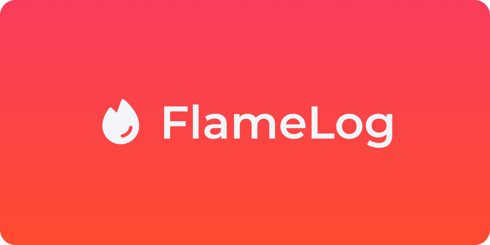

<div align="center">
  
  <h1>FlameLog API</h1>
  <i>Product development system for everyone 🔥</i>
  <br />
  <br />
  
  <br />
</div>

## 🤝 Contributing

### Prerequisites

- [Node.js 24+](https://nodejs.org) (it's recommended to install via [NVM](https://github.com/nvm-sh/nvm))

### Running project locally

1. Get a copy of the project:
```sh
git clone git@github.com:ErickMachado/api.flamelog.dev.git
```

2. Inside project's directory, execute the following command to use the recommended Node version for the project:
```sh
nvm use
```
